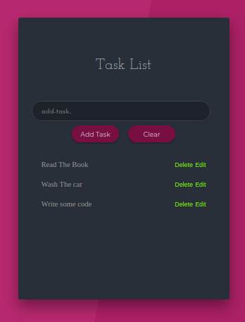

Runs the app in the development mode. 
Open [http://localhost:3000](http://localhost:3000) to view it in the browser.

# 
# Task Form
#

# 
# Added Heading and ui before functionality
#

# 
# Add Task working
#

